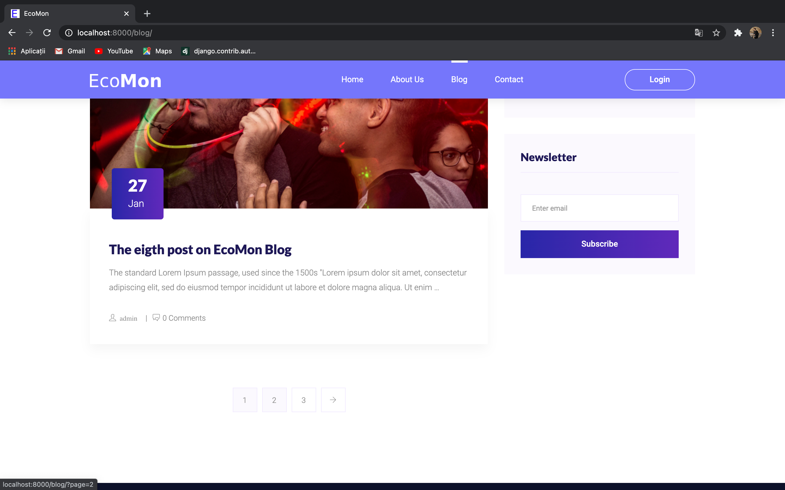

# EcoMon

First steps to do when setting the EcoMon project on your local machine with Django

## Getting Started

Setup project environment with [virtualenv](https://virtualenv.pypa.io) and [pip](https://pip.pypa.io).

```bash
$ virtualenv project-env
MacOS
    $ source project-env/bin/activate
Windows
    $ cd project-env/Scripts/activate
$ git clone https://github.com/aryanlilian/EcoMon.git
$ cd EcoMon
$ pip install -r requirements.txt

# You may want to change the name `project-env`.
$ python manage.py makemigrations
$ python manage.py migrate
$ python manage.py runserver
```
_I've built this website because I want to help a lot of people to manage their funds more efficiently and have a lot of savings every month, in order to start some small business or make a lot of investments._

_People have had money problems since always, and this inspired me to start this project, which is a very personalized money tracker. EcoMon helps any user with a friendly interface through pages like (Incomes, Spendings, Dashboard, Archive, etc.) with money tracking. The user can add personalized incomes, edit, delete and mark as recurrent in case of a salary, for example, the same with the spendings. The dashboard page is a funds presentation in real-time, tables, graphs, and more. For a better organization, the profile page handles the personal information. The blog can have different types of posts, and for better communication, users can add, edit, delete comments and reply to others' comments. These are just the most important functionalities of EcoMon._

#### Website Pages:
    - Index-Page: consists of a website presentation, explanation of all the features, newsletter subscription and has a warm welcome for the users.

    - Profile-Page: users can set or update personal information and the currency of the wallet.

    - Blog-Page: a page where users can read a lot of posts about money or how to manage them better and make savings, investments, etc. Also on this page for every post, users can write a comment and discuss it with other users on the website.

    - About-Page: consists of information about the platform, how was founded, and for what purpose

    - Contact-Page: consists of a contact form for users to get in touch with the staff and report problems or suggest ideas.

    - Login-Page: consists of a login form for the existent users.

    - Registration-Page: consists of registration form for the new users

    - Dashboard-Page: All the spendings and budgets have a total and you get your current total automatically with our website every time you add a new spending or income. On the Dashboard-Page you can see also how much of your incomes are the spendings and the savings (in percentages). This page has charts for better management of the incomes and spendings.

    - Income-Page: on this page, users can add personalized incomes and see all the incomes of the current month in a table, also the total incomes of the previous and current month.

    - Spending-Page: on this page users can add personalized spendings and see all the spendings of the current month in a table, also the total spendings of the previous and current month

    - Archive-Page: here practically you can see all your spendings, budgets, and savings from a specific year and month, as an archive. All the information is selected from the database to make the user experience more efficient.

    - Profile-Page: every personal information of a user is shown here, also the user can update every personal information for a better experience on the platform.

#### Features that I implemented so far:
    * User Authentication (Registration)
    * User Authentication (Login)
    * Google API (Login with Google)
    * Facebook API (Login with Facebook)
    * Email OTP verification after user registration (sending emails)
    * Filtering Blog posts by tags
    * Search bar for blog posts
    * Blog posts Full CRUD operations
    * Post comments Full CRUD operations
    * Comment replies Full CRUD operations
    * Contact Form (sending emails)
    * Newsletter subscription
    * User Incomes Full CRUD operations
    * User Spendings Full CRUD operations
    * Recurrency checking when deleting an object
    * Recurrency checking when updating an object
    * User Profile Update operations
    * Archive (Selecting objects from database within a date (month, year) range)
    * All forms validation (error messages are shown in case of invalid data)
    * JavaScript Charts
    * JavaScript interactive tables
    * User access verification for normal, staff, admin users.


Index-Page:


Blog-Page:




Post-Page:


Contact-Page:


Register-Page:


Invalid Register-Page:


Login-Page:


Email Non-verified:


Email Verification-sent:


Dashboard-Page:


Incomes-Page:


Spendings-Page:


Invalid Profile-Page:


Updated Profile-Page:


Archive-Page:


Logout-Page:


Forgot-Password-Page:

